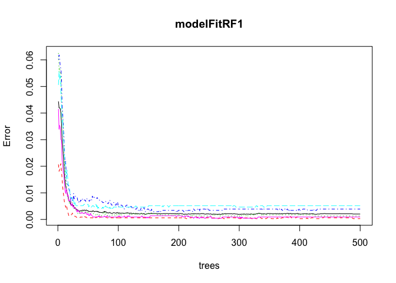

# Machine Learning Course Project
January 27, 2016  

##Background

Using devices such as Jawbone Up, Nike FuelBand, and Fitbit it is now possible to collect a large amount of data about personal activity relatively inexpensively. These type of devices are part of the quantified self movement – a group of enthusiasts who take measurements about themselves regularly to improve their health, to find patterns in their behavior, or because they are tech geeks. One thing that people regularly do is quantify how much of a particular activity they do, but they rarely quantify how well they do it. In this project, your goal will be to use data from accelerometers on the belt, forearm, arm, and dumbell of 6 participants. They were asked to perform barbell lifts correctly and incorrectly in 5 different ways. More information is available from the website here: <http://groupware.les.inf.puc-rio.br/har> (see the section on the Weight Lifting Exercise Dataset).

##Data

The training data for this project are available here:

<https://d396qusza40orc.cloudfront.net/predmachlearn/pml-training.csv>

The test data are available here:

<https://d396qusza40orc.cloudfront.net/predmachlearn/pml-testing.csv>

For ease of processing files and simplification of code, download the csv files and save to the set working directory.


```r
setwd("~/Desktop/coursera/MachineLearning")
```

Load the libraries we'll be using:

```r
## Load the preferred libraries 
library(caret) 
```

```
## Warning: package 'caret' was built under R version 3.2.3
```

```
## Loading required package: lattice
## Loading required package: ggplot2
```

```r
library(rpart)
library(plotmo)
```

```
## Loading required package: plotrix
```

```
## Warning: package 'plotrix' was built under R version 3.2.3
```

```
## Loading required package: TeachingDemos
```

```r
library(randomForest)
```

```
## randomForest 4.6-12
## Type rfNews() to see new features/changes/bug fixes.
```

```r
library(AppliedPredictiveModeling)
```

With the following code, we'll read the data, and take a quick look at the properties. I also took a quick look at the .csv file by opening the test version in Excel.


```r
pmlTrain <- read.csv("pml-training.csv", header=TRUE, na.strings=c("NA","#Div/0!"))  ## The training set
pmlTest <- read.csv("pml-testing.csv", header=TRUE, na.string=c("NA", "#Div/0!")) ## The test set -set aside
dim(pmlTrain)
```

```
## [1] 19622   160
```

```r
dim(pmlTest)
```

```
## [1]  20 160
```

```r
summary(pmlTrain$classe)
```

```
##    A    B    C    D    E 
## 5580 3797 3422 3216 3607
```

In the training set, there are 19622 records with 159 variables (the first column is just a numeric count of observations). The "classe" variable we are solving for is divided among 5 classes. 

The test set that was provided contains the exercise readings for 20 participants without the "classe" variable provided. We'll attempt to determine this "classe" with the use of predictive modelling, built using the training set. We'll set the test set to the side until the models are completed. At the end,  we'll apply the same cleaning and transformations to that data, then apply our model. 

###Cleaning the data

We'll clean out the <a href=http://www.inside-r.org/packages/cran/caret/docs/nearZeroVar>NearZeroVariance</a> variables, the observations that contain 75% "NA"s and remove them and the first column (a count of the observations) from our data as these will not contribute to the predictive model.

```r
nzv <- nearZeroVar(pmlTrain, saveMetrics=TRUE)  ## remove nearZeroVariances
pmlTrain <- pmlTrain[,nzv$nzv==FALSE]
pmlTrain <- pmlTrain[c(-1)]  ## remove first column (count)
```

Remove observations with 75% NA:

```r
noNAs<- pmlTrain ## find and remove 75% of NAs
for(i in 1:length(pmlTrain)) {
    if( sum( is.na( pmlTrain[, i] ) ) /nrow(pmlTrain) >= 0.75) {
        for(j in 1:length(noNAs)) {
            if( length( grep(names(pmlTrain[i]), names(noNAs)[j]) ) == 1)  {
                noNAs <- noNAs[ , -j]
            }   
        } 
    }
}
pmlTrain <- noNAs ## set back to name
rm(noNAs) ## remove excess data
dim(pmlTrain)
```

```
## [1] 19622    58
```
This brings us down to 58 columns.

### Split data

Now we'll split the data into a 60/40 training/test set to train the model then test the model before using for our prediction on the 20 observations in the final set. 


```r
inTrain <- createDataPartition(y=pmlTrain$classe,p=.60,list=FALSE)
train <-pmlTrain[inTrain,]
test <- pmlTrain[-inTrain,]
```

```r
dim(train)
```

```
## [1] 11776    58
```

```r
dim(test)
```

```
## [1] 7846   58
```


###Prediction with Random Forests
For <a href=http://www.statmethods.net/advstats/cart.html>Random Forest information</a>

```r
set.seed(4726)
modelFitRF1 <- randomForest(classe ~ ., data=train)
predictionRF1 <- predict(modelFitRF1, test, type = "class")
modelRF <- confusionMatrix(predictionRF1, test$classe)
modelRF
```

```
## Confusion Matrix and Statistics
## 
##           Reference
## Prediction    A    B    C    D    E
##          A 2232    1    0    0    0
##          B    0 1517    0    0    0
##          C    0    0 1368    2    0
##          D    0    0    0 1283    0
##          E    0    0    0    1 1442
## 
## Overall Statistics
##                                           
##                Accuracy : 0.9995          
##                  95% CI : (0.9987, 0.9999)
##     No Information Rate : 0.2845          
##     P-Value [Acc > NIR] : < 2.2e-16       
##                                           
##                   Kappa : 0.9994          
##  Mcnemar's Test P-Value : NA              
## 
## Statistics by Class:
## 
##                      Class: A Class: B Class: C Class: D Class: E
## Sensitivity            1.0000   0.9993   1.0000   0.9977   1.0000
## Specificity            0.9998   1.0000   0.9997   1.0000   0.9998
## Pos Pred Value         0.9996   1.0000   0.9985   1.0000   0.9993
## Neg Pred Value         1.0000   0.9998   1.0000   0.9995   1.0000
## Prevalence             0.2845   0.1935   0.1744   0.1639   0.1838
## Detection Rate         0.2845   0.1933   0.1744   0.1635   0.1838
## Detection Prevalence   0.2846   0.1933   0.1746   0.1635   0.1839
## Balanced Accuracy      0.9999   0.9997   0.9998   0.9988   0.9999
```

```r
plot(modelFitRF1)
```

 

```r
importance(modelFitRF1)
```

```
##                      MeanDecreaseGini
## user_name                    99.41925
## raw_timestamp_part_1        959.83120
## raw_timestamp_part_2         10.43113
## cvtd_timestamp             1404.87996
## num_window                  548.37137
## roll_belt                   529.29518
## pitch_belt                  288.82730
## yaw_belt                    330.86476
## total_accel_belt            102.39236
## gyros_belt_x                 35.66440
## gyros_belt_y                 49.37146
## gyros_belt_z                115.47769
## accel_belt_x                 62.55842
## accel_belt_y                 67.66678
## accel_belt_z                204.43511
## magnet_belt_x               109.68686
## magnet_belt_y               198.36895
## magnet_belt_z               184.29450
## roll_arm                    115.58013
## pitch_arm                    59.33342
## yaw_arm                      78.33470
## total_accel_arm              29.89071
## gyros_arm_x                  41.01084
## gyros_arm_y                  44.42476
## gyros_arm_z                  17.73433
## accel_arm_x                 112.11654
## accel_arm_y                  50.59634
## accel_arm_z                  39.84083
## magnet_arm_x                100.03965
## magnet_arm_y                 73.40716
## magnet_arm_z                 52.85177
## roll_dumbbell               198.33829
## pitch_dumbbell               85.38091
## yaw_dumbbell                105.92053
## total_accel_dumbbell        117.54049
## gyros_dumbbell_x             39.98732
## gyros_dumbbell_y             93.79208
## gyros_dumbbell_z             23.96779
## accel_dumbbell_x            123.06380
## accel_dumbbell_y            195.90148
## accel_dumbbell_z            129.87975
## magnet_dumbbell_x           243.53619
## magnet_dumbbell_y           320.06749
## magnet_dumbbell_z           276.07060
## roll_forearm                228.13865
## pitch_forearm               308.84946
## yaw_forearm                  52.48780
## total_accel_forearm          34.32158
## gyros_forearm_x              25.78570
## gyros_forearm_y              40.40463
## gyros_forearm_z              27.64530
## accel_forearm_x             138.74483
## accel_forearm_y              47.80771
## accel_forearm_z              95.13065
## magnet_forearm_x             74.29434
## magnet_forearm_y             73.68162
## magnet_forearm_z             91.20243
```

```r
print(modelRF)
```

```
## Confusion Matrix and Statistics
## 
##           Reference
## Prediction    A    B    C    D    E
##          A 2232    1    0    0    0
##          B    0 1517    0    0    0
##          C    0    0 1368    2    0
##          D    0    0    0 1283    0
##          E    0    0    0    1 1442
## 
## Overall Statistics
##                                           
##                Accuracy : 0.9995          
##                  95% CI : (0.9987, 0.9999)
##     No Information Rate : 0.2845          
##     P-Value [Acc > NIR] : < 2.2e-16       
##                                           
##                   Kappa : 0.9994          
##  Mcnemar's Test P-Value : NA              
## 
## Statistics by Class:
## 
##                      Class: A Class: B Class: C Class: D Class: E
## Sensitivity            1.0000   0.9993   1.0000   0.9977   1.0000
## Specificity            0.9998   1.0000   0.9997   1.0000   0.9998
## Pos Pred Value         0.9996   1.0000   0.9985   1.0000   0.9993
## Neg Pred Value         1.0000   0.9998   1.0000   0.9995   1.0000
## Prevalence             0.2845   0.1935   0.1744   0.1639   0.1838
## Detection Rate         0.2845   0.1933   0.1744   0.1635   0.1838
## Detection Prevalence   0.2846   0.1933   0.1746   0.1635   0.1839
## Balanced Accuracy      0.9999   0.9997   0.9998   0.9988   0.9999
```


###Prediction with Decision Trees
For <a href=http://blog.revolutionanalytics.com/2013/06/plotting-classification-and-regression-trees-with-plotrpart.html>decision tree information</a>

Instead of plotting a decision tree, we can quickly look at a graph of the cross-validation results, and review the confusion matrix resutls and see that the error rate is higher than the random forest method. 


```r
set.seed(4726)
modelFitDT1 <- rpart(classe ~.,method="class", data=train)
predictionDT1 <- predict(modelFitDT1, test, type = "class")
modelDT <- confusionMatrix(predictionDT1,test$classe)
plotcp(modelFitDT1)
```

 

```r
modelDT
```

```
## Confusion Matrix and Statistics
## 
##           Reference
## Prediction    A    B    C    D    E
##          A 2141   63    8    3    0
##          B   74 1289  107   65    0
##          C   17  158 1229  199   68
##          D    0    8   12  812   76
##          E    0    0   12  207 1298
## 
## Overall Statistics
##                                           
##                Accuracy : 0.8627          
##                  95% CI : (0.8549, 0.8703)
##     No Information Rate : 0.2845          
##     P-Value [Acc > NIR] : < 2.2e-16       
##                                           
##                   Kappa : 0.8263          
##  Mcnemar's Test P-Value : NA              
## 
## Statistics by Class:
## 
##                      Class: A Class: B Class: C Class: D Class: E
## Sensitivity            0.9592   0.8491   0.8984   0.6314   0.9001
## Specificity            0.9868   0.9611   0.9318   0.9854   0.9658
## Pos Pred Value         0.9666   0.8397   0.7355   0.8943   0.8556
## Neg Pred Value         0.9838   0.9637   0.9775   0.9317   0.9772
## Prevalence             0.2845   0.1935   0.1744   0.1639   0.1838
## Detection Rate         0.2729   0.1643   0.1566   0.1035   0.1654
## Detection Prevalence   0.2823   0.1956   0.2130   0.1157   0.1933
## Balanced Accuracy      0.9730   0.9051   0.9151   0.8084   0.9330
```

A quick look at the results on the Decision Tree method and we see a lower accuracy rate, 88.73, than the Random Forest accuracy rate of 99.83% witha .17% for our out-of-sample error rate, so we'll progress with the Random Forest for our prediction set.

###Predicting our results
First, we'll use the same cleaning methods as above:

```r
cleanFormat <- colnames(train[,-58]) # classe column removal
pmlTest <-pmlTest[cleanFormat]
dim(pmlTest)
```

```
## [1] 20 57
```

And we'll coerce the data into the same format:


```r
for (i in 1:length(pmlTest) ) {
    for(j in 1:length(train)) {
        if( length( grep(names(train[i]), names(pmlTest)[j]) ) == 1)  {
            class(pmlTest[j]) <- class(train[i])
        }      
    }      
}

# To get the same class between pmlTest and train
pmlTest <- rbind(train[2,-58], pmlTest) ## remove excess rows
pmlTest <- pmlTest[-1,]
```

Then we apply the prediction model to the data:

```r
predictionFinal <-predict(modelFitRF1, pmlTest, type="class")
```

And our final results for our 20 test cases.

```r
predictionFinal
```

```
## 22  3  4  5  6  7  8  9 10 11 12 13 14 15 16 17 18 19 20 21 
##  B  A  B  A  A  E  D  B  A  A  B  C  B  A  E  E  A  B  B  B 
## Levels: A B C D E
```

This created a 20/20 match for the quiz. 
