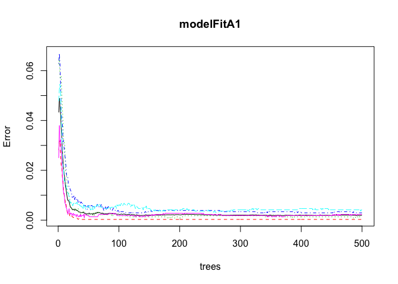
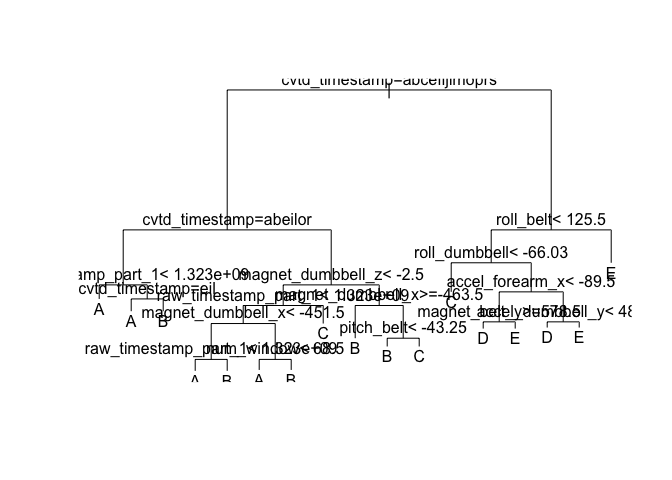
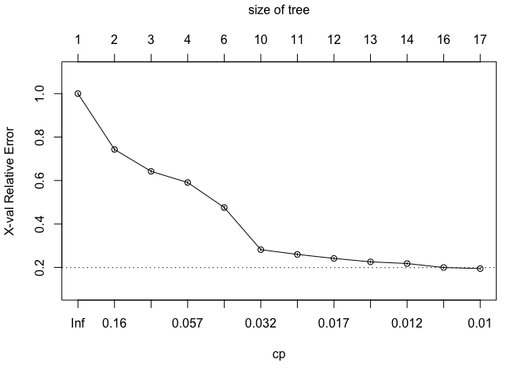

# Machine Learning Course Project
January 27, 2016  

##Background

Using devices such as Jawbone Up, Nike FuelBand, and Fitbit it is now possible to collect a large amount of data about personal activity relatively inexpensively. These type of devices are part of the quantified self movement – a group of enthusiasts who take measurements about themselves regularly to improve their health, to find patterns in their behavior, or because they are tech geeks. One thing that people regularly do is quantify how much of a particular activity they do, but they rarely quantify how well they do it. In this project, your goal will be to use data from accelerometers on the belt, forearm, arm, and dumbell of 6 participants. They were asked to perform barbell lifts correctly and incorrectly in 5 different ways. More information is available from the website here: <http://groupware.les.inf.puc-rio.br/har> (see the section on the Weight Lifting Exercise Dataset).

##Data

The training data for this project are available here:

<https://d396qusza40orc.cloudfront.net/predmachlearn/pml-training.csv>

The test data are available here:

<https://d396qusza40orc.cloudfront.net/predmachlearn/pml-testing.csv>
For ease of processing files and simplification of code, download the csv files and save to the set working directory, MachineLearning on the desktop.


```r
setwd("~/Desktop/coursera/MachineLearning")
```


```r
## Load the preferred libraries 
library(caret) 
```

```
## Warning: package 'caret' was built under R version 3.2.3
```

```
## Loading required package: lattice
## Loading required package: ggplot2
```

```r
library(rpart)
library(randomForest)
```

```
## randomForest 4.6-12
## Type rfNews() to see new features/changes/bug fixes.
```

```r
library(AppliedPredictiveModeling)
```

Two sets of data were provided, training and test. 

The Test set contains the exercise readings for 20 participants without the "classe" variable of exercise provided. We will attempt to determine this "classe" with the use of predictive modelling, built using the training set. We will set the Test set to the side until the models are completed.
 
 With the following code, we'll read the data.


```r
pmlTrain <- read.csv("pml-training.csv", header=TRUE, na.strings=c("NA","#Div/0!"))  ## The training set
pmlTest <- read.csv("pml-testing.csv", header=TRUE, na.string=c("NA", "#Div/0!")) ## The test set -set aside
dim(pmlTrain)
```

```
## [1] 19622   160
```

```r
dim(pmlTest)
```

```
## [1]  20 160
```

```r
summary(pmlTrain$classe)
```

```
##    A    B    C    D    E 
## 5580 3797 3422 3216 3607
```

There are 19622 records with 159 variables (the first column is just a numeric count of observations). The "classe" variable we are solving for is divided among 5 classes. 

###Cleaning the data

We'll clean out the <a href=http://www.inside-r.org/packages/cran/caret/docs/nearZeroVar>NearZeroVariance</a> variables and remove them from our data, and remove the first column, a count of the observations.

```r
nzv <- nearZeroVar(pmlTrain, saveMetrics=TRUE)  ## remove nearZeroVariances
pmlTrain <- pmlTrain[,nzv$nzv==FALSE]
pmlTrain <- pmlTrain[c(-1)]  ## remove first column (count)
```

Remove observations with 75% NA:

```r
noNAs<- pmlTrain ## find and remove 75% of NAs
for(i in 1:length(pmlTrain)) {
    if( sum( is.na( pmlTrain[, i] ) ) /nrow(pmlTrain) >= 0.75) {
        for(j in 1:length(noNAs)) {
            if( length( grep(names(pmlTrain[i]), names(noNAs)[j]) ) == 1)  {
                noNAs <- noNAs[ , -j]
            }   
        } 
    }
}
pmlTrain <- noNAs ## set back to name
rm(noNAs) ## remove excess data
dim(pmlTrain)
```

```
## [1] 19622    58
```
This brings us down to 58 columns.

### Split data

Now we'll split the data into a 60/40 training/test set to train the model then test the model before using for our prediction on the 20 observations in the final set. 


```r
inTrain <- createDataPartition(y=pmlTrain$classe,p=.60,list=FALSE)
train <-pmlTrain[inTrain,]
test <- pmlTrain[-inTrain,]
```

```r
dim(train)
```

```
## [1] 11776    58
```

```r
dim(test)
```

```
## [1] 7846   58
```


###Prediction with Random Forests
For <a href=http://www.statmethods.net/advstats/cart.html>Random Forest information</a>

```r
set.seed(4726)
modelFitA1 <- randomForest(classe ~ ., data=train)
predictionA1 <- predict(modelFitA1, test, type = "class")
modelRF <- confusionMatrix(predictionA1, test$classe)
modelRF
```

```
## Confusion Matrix and Statistics
## 
##           Reference
## Prediction    A    B    C    D    E
##          A 2232    1    0    0    0
##          B    0 1517    3    0    0
##          C    0    0 1365    2    0
##          D    0    0    0 1284    0
##          E    0    0    0    0 1442
## 
## Overall Statistics
##                                           
##                Accuracy : 0.9992          
##                  95% CI : (0.9983, 0.9997)
##     No Information Rate : 0.2845          
##     P-Value [Acc > NIR] : < 2.2e-16       
##                                           
##                   Kappa : 0.999           
##  Mcnemar's Test P-Value : NA              
## 
## Statistics by Class:
## 
##                      Class: A Class: B Class: C Class: D Class: E
## Sensitivity            1.0000   0.9993   0.9978   0.9984   1.0000
## Specificity            0.9998   0.9995   0.9997   1.0000   1.0000
## Pos Pred Value         0.9996   0.9980   0.9985   1.0000   1.0000
## Neg Pred Value         1.0000   0.9998   0.9995   0.9997   1.0000
## Prevalence             0.2845   0.1935   0.1744   0.1639   0.1838
## Detection Rate         0.2845   0.1933   0.1740   0.1637   0.1838
## Detection Prevalence   0.2846   0.1937   0.1742   0.1637   0.1838
## Balanced Accuracy      0.9999   0.9994   0.9987   0.9992   1.0000
```

```r
plot(modelFitA1)
```

 

```r
importance(modelFitA1)
```

```
##                      MeanDecreaseGini
## user_name                    89.77920
## raw_timestamp_part_1        953.77048
## raw_timestamp_part_2         10.72094
## cvtd_timestamp             1430.59179
## num_window                  538.66808
## roll_belt                   523.70417
## pitch_belt                  301.98972
## yaw_belt                    351.15694
## total_accel_belt            111.99706
## gyros_belt_x                 36.92476
## gyros_belt_y                 52.32103
## gyros_belt_z                113.29464
## accel_belt_x                 64.46205
## accel_belt_y                 65.38756
## accel_belt_z                200.47035
## magnet_belt_x               111.92927
## magnet_belt_y               197.78657
## magnet_belt_z               188.14990
## roll_arm                    119.77482
## pitch_arm                    55.33093
## yaw_arm                      82.13894
## total_accel_arm              29.01066
## gyros_arm_x                  42.41750
## gyros_arm_y                  41.80405
## gyros_arm_z                  18.06497
## accel_arm_x                  84.11830
## accel_arm_y                  54.05321
## accel_arm_z                  39.32734
## magnet_arm_x                 84.38316
## magnet_arm_y                 71.14505
## magnet_arm_z                 52.26065
## roll_dumbbell               189.65772
## pitch_dumbbell               83.99346
## yaw_dumbbell                112.99471
## total_accel_dumbbell        117.74722
## gyros_dumbbell_x             40.69216
## gyros_dumbbell_y            107.88070
## gyros_dumbbell_z             22.68877
## accel_dumbbell_x            133.68755
## accel_dumbbell_y            187.83419
## accel_dumbbell_z            133.96881
## magnet_dumbbell_x           221.40833
## magnet_dumbbell_y           310.57406
## magnet_dumbbell_z           304.41019
## roll_forearm                250.93362
## pitch_forearm               299.34184
## yaw_forearm                  48.79677
## total_accel_forearm          29.46125
## gyros_forearm_x              26.18619
## gyros_forearm_y              40.88536
## gyros_forearm_z              26.54757
## accel_forearm_x             130.86616
## accel_forearm_y              43.08441
## accel_forearm_z              90.79598
## magnet_forearm_x             70.05236
## magnet_forearm_y             75.82485
## magnet_forearm_z             93.14230
```

```r
print(modelRF)
```

```
## Confusion Matrix and Statistics
## 
##           Reference
## Prediction    A    B    C    D    E
##          A 2232    1    0    0    0
##          B    0 1517    3    0    0
##          C    0    0 1365    2    0
##          D    0    0    0 1284    0
##          E    0    0    0    0 1442
## 
## Overall Statistics
##                                           
##                Accuracy : 0.9992          
##                  95% CI : (0.9983, 0.9997)
##     No Information Rate : 0.2845          
##     P-Value [Acc > NIR] : < 2.2e-16       
##                                           
##                   Kappa : 0.999           
##  Mcnemar's Test P-Value : NA              
## 
## Statistics by Class:
## 
##                      Class: A Class: B Class: C Class: D Class: E
## Sensitivity            1.0000   0.9993   0.9978   0.9984   1.0000
## Specificity            0.9998   0.9995   0.9997   1.0000   1.0000
## Pos Pred Value         0.9996   0.9980   0.9985   1.0000   1.0000
## Neg Pred Value         1.0000   0.9998   0.9995   0.9997   1.0000
## Prevalence             0.2845   0.1935   0.1744   0.1639   0.1838
## Detection Rate         0.2845   0.1933   0.1740   0.1637   0.1838
## Detection Prevalence   0.2846   0.1937   0.1742   0.1637   0.1838
## Balanced Accuracy      0.9999   0.9994   0.9987   0.9992   1.0000
```


###Prediction with Decision Trees
<a href=http://blog.revolutionanalytics.com/2013/06/plotting-classification-and-regression-trees-with-plotrpart.html>Create decision tree</a>

Instead of plotting a decision tree, we can quickly look at a graph of the cross-validation results, and see that the error rate is higher than the random forest method. 


```r
set.seed(4726)
modelFitB1 <- rpart(classe ~., method="class", data=train)
plot(modelFitB1)
text(modelFitB1)
```

 

```r
plotcp(modelFitB1)
```

 

A quick look at the results on teh decision tree and we see the variables we're looking for intermingled. The Random Forest has a 99.83% accuracy rate, a .17% out-of-sample error rate, so we'll progress with this for our prediction set.

###Predicting our results
First, we'll use the same cleaning methods as above:

```r
cleanFormat <- colnames(train[,-58]) # classe column removal
pmlTest <-pmlTest[cleanFormat]
dim(pmlTest)
```

```
## [1] 20 57
```

And we'll coerce the data into the same format:


```r
for (i in 1:length(pmlTest) ) {
    for(j in 1:length(train)) {
        if( length( grep(names(train[i]), names(pmlTest)[j]) ) == 1)  {
            class(pmlTest[j]) <- class(train[i])
        }      
    }      
}

# To get the same class between pmlTest and train
pmlTest <- rbind(train[2,-58], pmlTest) ## remove excess rows
pmlTest <- pmlTest[-1,]
```

Then we apply the prediction model to the data:

```r
predictionFinal <-predict(modelFitA1, pmlTest, type="class")
```

And our final results.

```r
predictionFinal
```

```
## 22  3  4  5  6  7  8  9 10 11 12 13 14 15 16 17 18 19 20 21 
##  B  A  B  A  A  E  D  B  A  A  B  C  B  A  E  E  A  B  B  B 
## Levels: A B C D E
```


